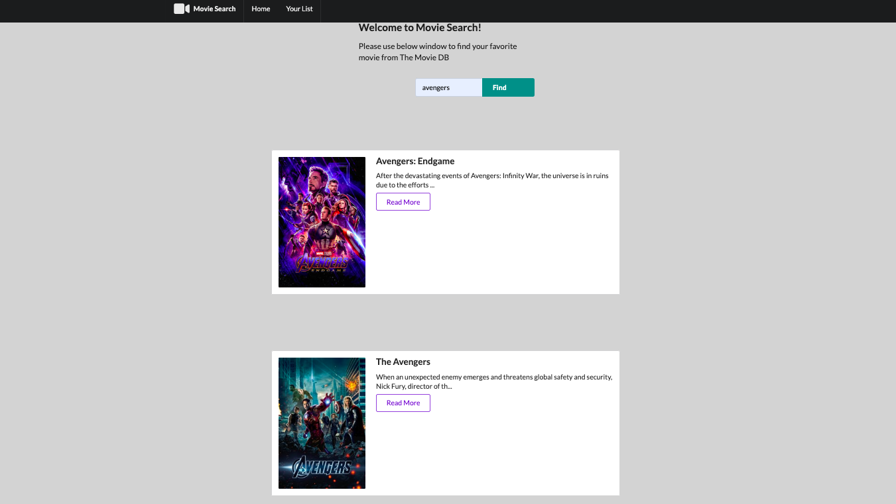

# Movie-Search
>

Movie Search is MERN (MongoDB, Express, React,NodeJS) stack web application.
The web-app allows user search for movie through The Movie DB API.

See demo at https://movie-demo-lana.herokuapp.com/

## Table of Contents

1. [Setup](#Setup)
1. [Requirements](#requirements)

## To Set Up & Run Locally
- npm install
- npm run react-dev to run webpack
- npm start to run server
- run mongod in terminal tab, run mongo in new terminal tab

## Requirements
-  Node 10.15.3
-  mongoDB(or mLab)

### Installing Dependencies

From within the root directory:
npm install -g webpack
npm install

## Running Tests
- npm test to run jest unit test suite for all components 

## Acknowledgements
- Thanks to everyone on the JISHAX team for builing awesome modules that bring to life the Drop Table verison of the Open table restaurant page user experience! 

